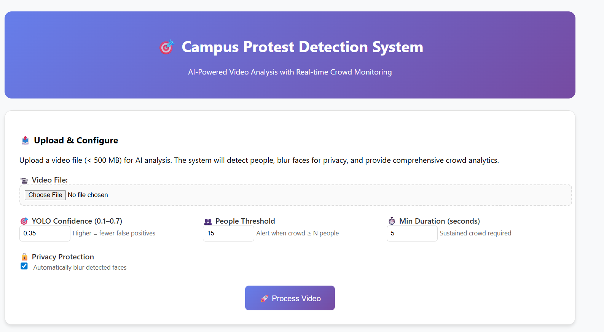
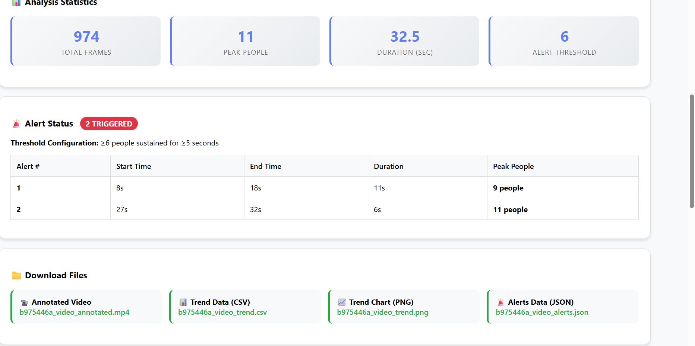
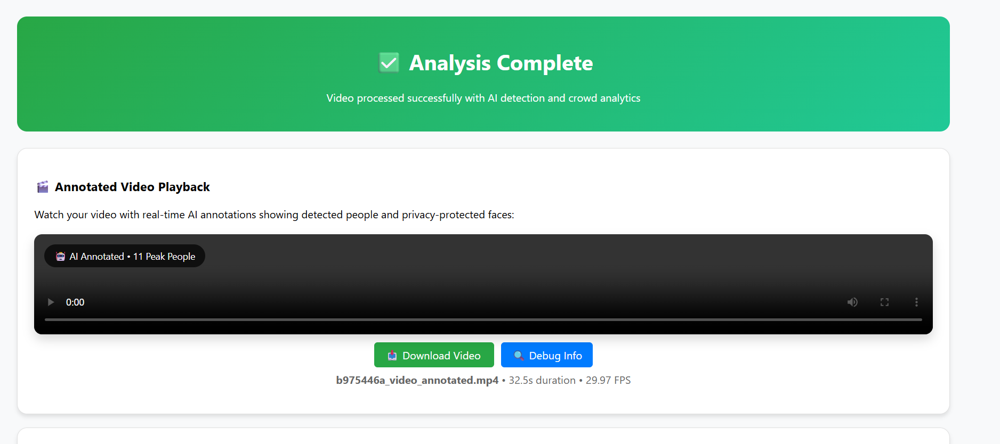
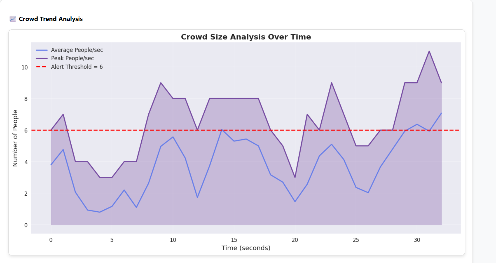

# 🛡️ AI Protest Detection System

Real-time campus protest detection using YOLOv8, OpenCV, and AWS services.  
Uploads videos, detects crowd clustering, sends email alerts, and exports trend data.

---

## ⚙️ Features

- 🎯 Object detection with YOLOv8  
- 🧠 Protest behavior recognition (loitering, clustering)  
- 📬 Email alerts via AWS SNS (threshold-based)  
- 📊 Uploads to S3 (videos + charts)  
- 📈 Trend analysis via CSV + PNG charts  
- 🚀 Deployable with EC2, Gunicorn, Nginx  
- 🔁 CI/CD ready (GitHub Actions, Terraform, or AWS CodePipeline)

---

## 🧠 Use Cases

- Campus protest alerts  
- Security threat monitoring  
- Event crowd control  
- Loitering/clustering detection  

---

## 👨‍💻 Author

**Emmanuel Akorefe**  
📎 [GitHub](https://github.com/emmanuelakorefe)  
📜 MIT License — feel free to fork, modify, and deploy.

---

## 📸 Demo Screenshots

1. **Upload Page**  
   

2. **Detection in Action**  
   

3. **AWS SNS Email Alert**  
   

4. **Chart and CSV Export**  
   

5. **Annotated Video Playback**  
   

---

## 🚀 Getting Started

```bash
# Clone repo
git clone https://github.com/emmanuelakorefe/ai-protest-detection.git
cd ai-protest-detection

# Install dependencies
pip install -r requirements.txt

# Run app
python app.py
```

---

## 🐳 Docker Setup

```bash
# Build Docker image
docker build -t protest-detect .

# Run container
docker run -p 5000:5000 protest-detect
```

---

## 🏗️ Deployment Options

- Terraform + EC2 + Gunicorn + Nginx  
- AWS SNS for notifications  
- S3 for video/chart storage  
- GitHub Actions for CI/CD  

---

## 🧪 Testing

```bash
# Run test script (optional)
python test.py
```

---

### 📝 Notes:
- Make sure your screenshot images are placed in the folder:  
  `screenshots/protest-detection-1.png`, `...-2.png`, etc.
- If you name your images differently, update the image paths in the markdown.
