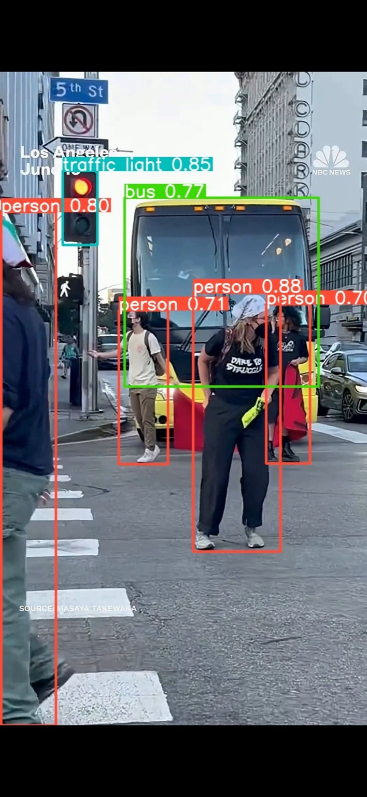

# 📢 AI Protest Detection System

An intelligent surveillance system that detects protest-like group behavior using **YOLOv8**, **OpenCV**, and **AWS services**. Designed for public and campus safety with real-time detection, alerting, and video playback.

---

## 🚀 Features

- 🔍 Real-time people detection with YOLOv8
- ⚠️ Protest threshold alerts (e.g., ≥N people for ≥D seconds)
- 📧 AWS SNS email notifications with images and links
- 🛡️ Face blurring for privacy
- 🌐 Web-based UI (Flask)
- ☁️ Uploads to S3 (videos + charts)
- 📊 Trend analysis via CSV + PNG charts
- 📦 Deployable with EC2, Gunicorn, Nginx

---

## 🖥️ Demo Screenshots

### 1. Upload Page  


### 2. Detection in Action  


### 3. AWS SNS Email Alert  


### 4. Chart and CSV Export  


### 5. Annotated Video Playback  


---

## 📦 Tech Stack

- **Frontend**: HTML (Flask template)
- **Backend**: Python + Flask
- **Detection**: YOLOv8 + OpenCV
- **Cloud**: AWS SNS, S3
- **Deployment**: EC2, Gunicorn, Nginx

---

## ⚙️ How to Run

```bash
git clone https://github.com/emmanuelakorefe/ai-protest-detection.git
cd ai-protest-detection

➡️ Visit http://localhost:5000 in your browser.

gunicorn app:app --bind 0.0.0.0:5000

📤 Deployment Options

EC2 with Elastic IP + Nginx

Docker (optional)

CI/CD: GitHub Actions, Terraform, or AWS CodePipeline

🎯 Use Cases

Campus protest alerts

Security threat monitoring

Event crowd control

Loitering/clustering detection

👤 Author

Emmanuel Akorefe
🔗 GitHub
📄 License

MIT License — Feel free to fork, modify, and deploy.

---

Once you save this as `README.md`, do the following:

```bash
git add README.md
git commit -m "Added updated README with renamed screenshots"
git push origin main

pip install -r requirements.txt
python app.py
